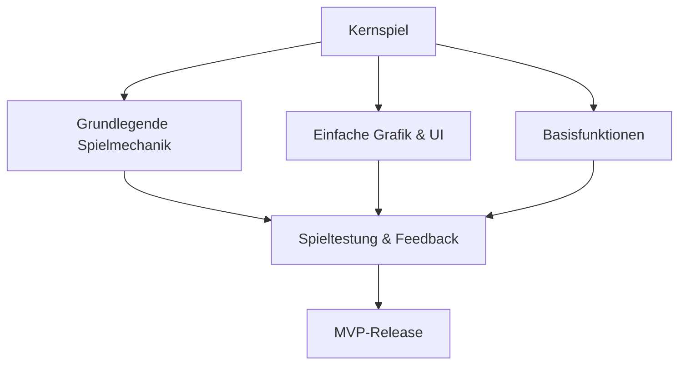

# Endless Runner MVP - Anforderungen

## Übersicht

## 1. Kernspiel-Anforderungen

### 1.1 Spielmechanik
- **Rollender Würfel-Charakter**: Ein einfacher Würfel, der über den Boden rollt
- **Umgekehrte Welt**: Himmel unten, Boden oben (wie in der ursprünglichen Anforderung)
- **Hindernisse**: Einfache Hindernisse, die vom Spieler übersprungen werden müssen
- **Sprungmechanik**: Einfache Steuerung mit Leertaste zum Springen
- **Kollisionserkennung**: Grundlegende Erkennung von Kollisionen zwischen Spieler und Hindernissen
- **Punktesystem**: Zähler erhöht sich bei jedem übersprungenen Hindernis
- **Leben-System**: Spieler hat 5 Leben, die bei Kollisionen verloren gehen

### 1.2 Spielablauf
- **Startbildschirm**: Einfacher Startbildschirm mit Spieltitel und Startanweisung
- **Spielende**: Game-Over-Bildschirm, wenn alle Leben verloren sind
- **Neustart**: Möglichkeit, das Spiel nach dem Game Over neu zu starten
- **Schwierigkeitssteigerung**: Langsam ansteigende Geschwindigkeit und Hindernisdichte

## 2. Grafische Anforderungen

### 2.1 Visuelle Elemente
- **Spielercharakter**: Farbiger Würfel mit unterschiedlichen Farben für jede Seite
- **Himmel**: Blauer Himmel unten mit Farbverlauf
- **Boden**: Einfacher Boden oben mit Textur
- **Hindernisse**: Einfache geometrische Formen in kontrastierenden Farben
- **Hintergrund**: Einfache Berge oder Wolken für Tiefenwirkung

### 2.2 Benutzeroberfläche
- **Punkteanzeige**: Deutlich sichtbare Anzeige des aktuellen Punktestands
- **Leben-Anzeige**: Grafische Darstellung der verbleibenden Leben (z.B. Herzen oder Würfel-Icons)
- **Game-Over-Bildschirm**: Anzeige des Endpunktstands und Neustart-Option
- **Minimalistisches Design**: Nur notwendige UI-Elemente, um das Spielerlebnis nicht zu stören

## 3. Technische Anforderungen

### 3.1 Plattform
- **Webbrowser**: Funktioniert in modernen Browsern ohne Installation
- **Responsive Design**: Passt sich verschiedenen Bildschirmgrößen an
- **Leichte Grafik**: Optimiert für ältere Hardware und mobile Geräte

### 3.2 Performance
- **Stabile Framerate**: Konstante 60 FPS für flüssiges Spielerlebnis
- **Geringe Ladezeit**: Schneller Start des Spiels ohne lange Ladezeiten
- **Speichermanagement**: Effiziente Verwaltung von Ressourcen für stabiles Spielerlebnis

## 4. Implementierungsplan

### 4.1 Phase 1: Grundlegende Spielmechanik
- Implementierung des rollenden Würfels
- Umgekehrte Welt-Darstellung (Himmel unten, Boden oben)
- Grundlegende Sprungmechanik
- Einfache Hindernisse

### 4.2 Phase 2: Spiellogik
- Kollisionserkennung
- Punktesystem für übersprungene Hindernisse
- Leben-System mit 5 Leben
- Game-Over-Zustand und Neustart

### 4.3 Phase 3: UI und Polishing
- Implementierung der Benutzeroberfläche
- Verbesserung der visuellen Elemente
- Hinzufügen von Soundeffekten
- Performance-Optimierung

## 5. Erweiterungsmöglichkeiten (Post-MVP)

Diese Funktionen sind nicht Teil des MVP, können aber nach erfolgreicher Implementierung der Grundfunktionen hinzugefügt werden:

- **Verschiedene Charaktere**: Freischaltbare alternative Würfel-Charaktere
- **Power-ups**: Spezielle Items, die dem Spieler temporäre Vorteile geben
- **Highscore-Liste**: Speicherung und Anzeige der besten Punktzahlen
- **Verschiedene Umgebungen**: Unterschiedliche Themen für die Spielwelt
- **Soziale Funktionen**: Teilen von Ergebnissen in sozialen Medien
- **Achievements**: Freischaltbare Erfolge für bestimmte Leistungen
- **Tägliche Herausforderungen**: Spezielle tägliche Spielmodi

## 6. Technische Umsetzung

### 6.1 Verwendete Technologien
- **Three.js**: Für 3D-Rendering und Physik
- **HTML5/CSS3**: Für UI-Elemente und Styling
- **JavaScript**: Für Spiellogik und Interaktionen

### 6.2 Codestruktur
- **Modularer Aufbau**: Trennung von Spiellogik, Rendering und UI
- **Objektorientierter Ansatz**: Klare Klassenstruktur für Spielelemente
- **Ereignisbasierte Architektur**: Für reaktive Spielmechaniken und UI-Updates