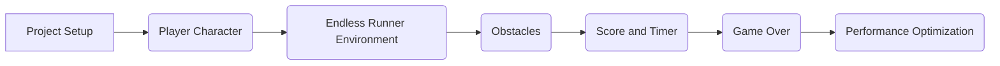

# Three.js Endless Runner Game Plan

1.  **Project Setup:** Create a basic three.js project with a simple scene and camera.
2.  **Player Character:** Create a player character using vector graphics or simple 3D models. Implement keyboard controls for movement (jump, slide, etc.).
3.  **Endless Runner Environment:** Create an endless runner environment with repeating sections. Implement shaders for the background to create a sense of depth and movement.
4.  **Obstacles:** Create obstacles with varying shapes and sizes. Implement collision detection between the player and obstacles.
5.  **Score and Timer:** Implement a score and timer system to track the player's progress.
6.  **Game Over:** Implement a game over screen when the player collides with an obstacle.
7.  **Performance Optimization:** Optimize the game for performance by using techniques such as object pooling and frustum culling.