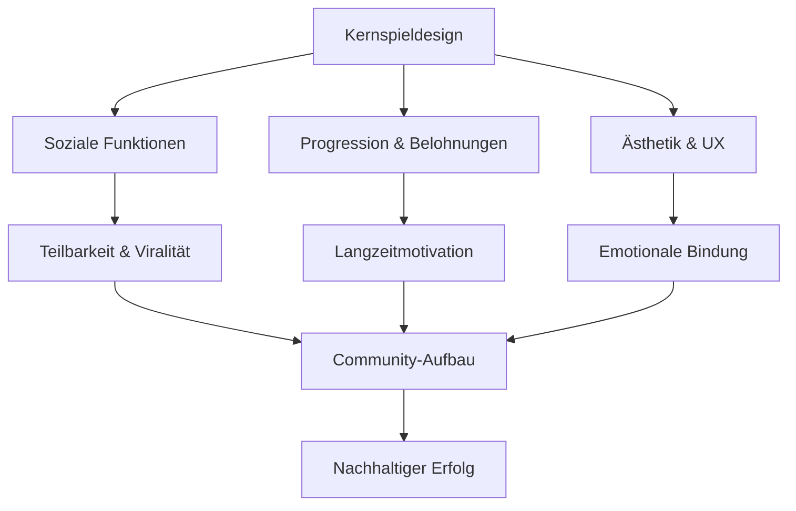

# Anforderungen für ein modernes, teilbares Spiel

## Übersicht

## 1. Kernspieldesign & Gameplay

### 1.1 Zugänglichkeit mit Tiefe
- **Einfacher Einstieg**: Intuitive Steuerung, die in Sekunden erlernbar ist
- **Schwierigkeitskurve**: Progressiv ansteigende Herausforderung, die Spieler langfristig fordert
- **Skill-basiertes Gameplay**: Belohnung für Geschicklichkeit und Übung, nicht nur für Zeit/Glück
- **Kurze Spielsessions**: 2-5 Minuten pro Runde, ideal für mobile Nutzung und "Quick Plays"

### 1.2 Kernmechaniken
- **Einzigartige Spielmechanik**: Eine zentrale, differenzierende Mechanik (z.B. Zeit-Manipulation, Umgebungsinteraktion)
- **Überraschungselemente**: Unvorhersehbare Events, die jede Spielsession einzigartig machen
- **Risiko-Belohnungs-System**: Spieler können höhere Risiken für größere Belohnungen eingehen
- **Metaspiel**: Strategische Entscheidungen zwischen den Spielrunden (Upgrades, Charakterentwicklung)

### 1.3 Spielmodi
- **Einzelspieler-Kampagne**: Story-basierte Progression mit Zielen und Herausforderungen
- **Endlosmodus**: Klassisches Endless-Runner-Erlebnis mit Highscore-Jagd
- **Tägliche Herausforderungen**: Wechselnde Szenarien mit speziellen Regeln
- **Multiplayer-Optionen**: Asynchrone oder Echtzeit-Wettbewerbe gegen Freunde

## 2. Soziale Funktionen & Teilbarkeit

### 2.1 Soziale Integration
- **Nahtlose Anmeldung**: Login mit sozialen Medien (Facebook, Google, Apple)
- **Freundesliste**: Einfaches Hinzufügen und Verfolgen von Freunden
- **Leaderboards**: Globale und freundesbezogene Bestenlisten
- **Achievements**: Teilbare Erfolge und Meilensteine

### 2.2 Teilbarkeitsfunktionen
- **Replay-System**: Automatische Aufzeichnung spektakulärer Momente
- **Screenshot-Funktion**: Einfaches Erstellen und Teilen von Spielmomenten
- **Direkte Teilen-Buttons**: Integration mit WhatsApp, Instagram, TikTok etc.
- **Herausforderungssystem**: Spieler können Freunde zu bestimmten Levels herausfordern

### 2.3 Community-Funktionen
- **In-Game-Chat**: Kommunikation mit Freunden während des Spiels
- **Clans/Teams**: Gruppenbildung für gemeinsame Ziele
- **Community-Events**: Zeitlich begrenzte Events mit speziellen Belohnungen
- **User-Generated Content**: Möglichkeit für Spieler, eigene Levels zu erstellen und zu teilen

## 3. Progression & Belohnungssystem

### 3.1 Spielerprogression
- **Charakterentwicklung**: Freischaltbare Fähigkeiten und Verbesserungen
- **Level-System**: Klare Fortschrittsindikatoren mit Belohnungen
- **Skill-Bäume**: Verschiedene Entwicklungspfade für unterschiedliche Spielstile
- **Prestige-System**: Möglichkeit zum Zurücksetzen mit Langzeitvorteilen

### 3.2 Belohnungsmechanismen
- **Regelmäßige Belohnungen**: Tägliche Login-Boni und Quests
- **Überraschungsbelohnungen**: Unerwartete Geschenke für bestimmte Aktionen
- **Sammelsystem**: Freischaltbare Charaktere, Skins, Effekte etc.
- **Währungssystem**: Verschiedene Währungen für unterschiedliche Aspekte des Spiels

### 3.3 Langzeitmotivation
- **Saisonale Inhalte**: Regelmäßig wechselnde Themen und Herausforderungen
- **Battle Pass**: Premium-Progressionssystem mit exklusiven Belohnungen
- **Endgame-Content**: Besonders herausfordernde Inhalte für erfahrene Spieler
- **Regelmäßige Updates**: Neue Inhalte, die Spieler zum Zurückkehren motivieren

## 4. Ästhetik & Benutzererfahrung

### 4.1 Visuelles Design
- **Einprägsamer Stil**: Unverwechselbarer, wiedererkennbarer Kunststil
- **Visuelle Klarheit**: Deutliche Unterscheidung zwischen interaktiven und dekorativen Elementen
- **Animationsqualität**: Flüssige, befriedigende Bewegungen und Effekte
- **Farbpsychologie**: Gezielte Farbpaletten für emotionale Wirkung

### 4.2 Audio-Design
- **Einprägsame Soundeffekte**: Akustisches Feedback, das Spielaktionen verstärkt
- **Dynamischer Soundtrack**: Musik, die sich an Spielsituationen anpasst
- **Sprachausgabe**: Optional für Story-Elemente und Charakterpersönlichkeit
- **Sound-Branding**: Wiedererkennbare Audio-Elemente für Markenidentität

### 4.3 Benutzeroberfläche
- **Minimalistisches UI**: Nur notwendige Informationen, keine Überladung
- **Anpassbare HUD**: Spieler können Interface nach Bedarf anpassen
- **Intuitive Navigation**: Klare Menüstruktur ohne unnötige Komplexität
- **Barrierefreiheit**: Optionen für Farbenblindheit, Textgröße etc.

## 5. Technische Anforderungen

### 5.1 Plattformübergreifende Verfügbarkeit
- **Web-Version**: Spielbar im Browser ohne Installation
- **Mobile Apps**: Native Apps für iOS und Android
- **Desktop-Version**: Optional für erweiterte Features
- **Cross-Progression**: Spielfortschritt synchronisiert über alle Plattformen

### 5.2 Performance
- **Niedrige Systemanforderungen**: Läuft auf älteren Geräten
- **Offline-Modus**: Grundfunktionen ohne Internetverbindung nutzbar
- **Schnelle Ladezeiten**: Minimale Wartezeiten zwischen Spielsessions
- **Batterieschonung**: Optimiert für mobilen Einsatz

### 5.3 Backend-Infrastruktur
- **Skalierbare Server**: Bewältigung von Nutzerspitzen
- **Datensicherheit**: Sichere Speicherung von Nutzerdaten
- **Analytics**: Umfassende Datenerfassung für Spielverbesserung
- **A/B-Testing**: Infrastruktur für Feature-Tests

## 6. Monetarisierung (optional)

### 6.1 Monetarisierungsmodell
- **Free-to-Play**: Grundspiel kostenlos mit optionalen Käufen
- **Premium-Inhalte**: Zusätzliche Charaktere, Skins, Effekte
- **Abonnement-Option**: Premium-Pass mit exklusiven Vorteilen
- **Werbung**: Optional, mit Belohnungen für Werbebetrachtung

### 6.2 Fairness-Prinzipien
- **Keine Pay-to-Win-Elemente**: Käufe bieten keine spielerischen Vorteile
- **Transparente Preisgestaltung**: Klare Kommunikation von Kosten
- **Wertvolle Käufe**: Jeder Kauf bietet angemessenen Gegenwert
- **Großzügige F2P-Erfahrung**: Vollständiges Spielerlebnis ohne Ausgaben möglich

## 7. Innovationspotenzial

### 7.1 Differenzierungsmerkmale
- **Einzigartige Spielmechanik**: Eine zentrale Innovation, die das Spiel von Konkurrenten abhebt
- **Kreative Thematik**: Ungewöhnliches Setting oder Konzept
- **Neue Interaktionsformen**: Innovative Nutzung von Gerätefunktionen (Kamera, Bewegungssensoren)
- **Crossmedia-Integration**: Verbindung mit anderen Medien oder Plattformen

### 7.2 Zukunftspotenzial
- **Erweiterbarkeit**: Grundkonzept erlaubt vielfältige Erweiterungen
- **Franchise-Potenzial**: Möglichkeit für Spin-offs und Erweiterungen
- **Technologie-Roadmap**: Plan für Integration neuer Technologien (AR, VR)
- **Community-Wachstum**: Strategie für langfristigen Community-Aufbau